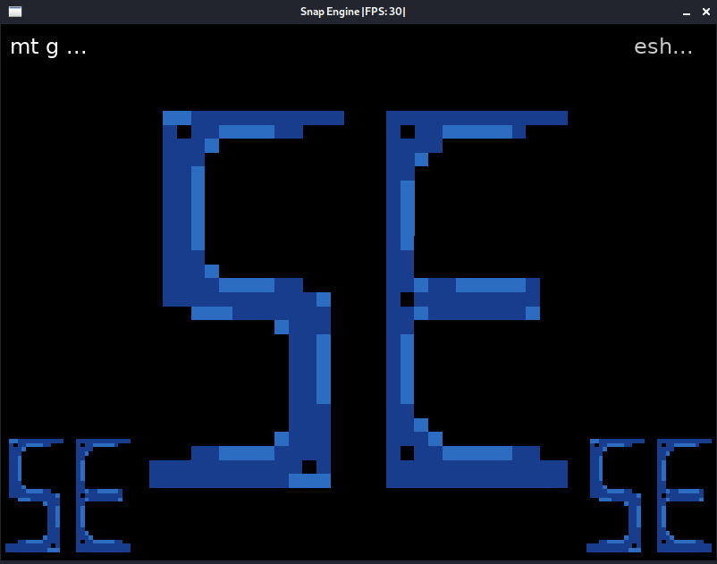

# Snap

> Simple educational micro engine, designed with Golang and SDL2 bindings.
> It allows quickly setup code challenge with visualizations, simple game mechanics, or scenes with 2D graphics.
> 
> For simple game making or for more complicated processing it will be better use directly SDL2 with C++.

___

## Build

Build command can be different on your OS but that shouldn't be difficult, since SDL2 can be compiled on any platform.

If you are using Linux Debian 10, then you can execute this:
```text
env CGO_ENABLED=1 CC=gcc GOOS=linux GOARCH=amd64 go build -tags -gcflags="all=-N -l" -o Snap --race main.go
```

### Dependencies

Debian like:
- `apt install libsdl2{,-image,-gfx}-dev`

Darwin:
- `brew install sdl2{,_image,_gfx} pkg-config`

[More explanations can be found in sdl2 go bindings](https://github.com/veandco/go-sdl2#requirements)


## Usage

1. To manipulate rendering you need initialize engine first:

```text
engine.New(config platform.ScreenConfiguration, isDebugMode bool)
```
- Predefine your screen configuration before and then provide it to engine, so that would be rendered.
- If you're looking for debug logs, track mouse events like coordinate axis or keyboard events. Set it as `true`.

2. Next, you need to load your predefined scene objects/actors. Look up in `engine/entity`, there is some simple one
but for your case, it might be needed to implement a specific actor. Take a look at the `type SceneObject interface`.


3. In the end, your realisation must handle the execution of the main loop process, all errors will be propagated from the engine to your control.
```text
if err := snapEngine.Run(); err != nil {
	panic(err.Error())
}
```

## Example of main file
Example of main file to test render, 2 text output blocks, 3 logo sprites on the screen:
```go
package main

import (
	"fmt"
	"math/rand"
	"time"

	"github.com/LinMAD/Snap/engine"
	"github.com/LinMAD/Snap/engine/entity"
	"github.com/LinMAD/Snap/engine/graphics/data"
	"github.com/LinMAD/Snap/engine/platform"
)

func init() {
	rand.Seed(time.Now().UnixNano())
}

func main() {
	screenConfig := &platform.ScreenConfiguration{Width: 800, Height: 600}
	isDebugMode := true
	leftTextCornerBlock := entity.NewTextObject(
		&entity.Position{X: 10, Y: 10},
		&data.FontData{
			ID:           "LeftTopCornerText",
			FontFilePath: "assets/SimpleFont.ttf",
			Size:         24,
		},
		&entity.Color{Red: 255, Green: 255, Blue: 255},
	)
	rightTextCornerBlock := entity.NewTextObject(
		&entity.Position{X: int32(screenConfig.Width - 100), Y: 10},
		&data.FontData{
			ID:           "RightTopCornerText",
			FontFilePath: "assets/SimpleFont.ttf",
			Size:         36,
		},
		&entity.Color{Red: 200, Green: 200, Blue: 200},
	)

	actors := []entity.SceneObject{
		entity.NewStaticObject(
			&entity.Position{X: 150, Y: 50},
			&entity.DrawableInformation{
				Width:  500,
				Height: 500,
				TextureData: &data.TextureData{
					ImageFilePath: "assets/snap_engine_logo.png",
					ID:            "snap_logo",
				},
				Color: &entity.Color{Red: 255, Green: 255, Blue: 255}, // Full color of image
			},
		),
		entity.NewStaticObject(
			&entity.Position{X: 0, Y: int32(screenConfig.Height - 150)},
			&entity.DrawableInformation{
				Width:  150,
				Height: 150,
				TextureData: &data.TextureData{
					ImageFilePath: "assets/snap_engine_logo.png",
					ID:            "snap_logo",
				},
				Color: &entity.Color{Red: 255, Green: 255, Blue: 255}, // Full color of image
			},
		),
		entity.NewStaticObject(
			&entity.Position{X: int32(screenConfig.Width - 150), Y: int32(screenConfig.Height - 150)},
			&entity.DrawableInformation{
				Width:  150,
				Height: 150,
				TextureData: &data.TextureData{
					ImageFilePath: "assets/snap_engine_logo.png",
					ID:            "snap_logo",
				},
				Color: &entity.Color{Red: 255, Green: 255, Blue: 255}, // Full color of image
			},
		),
		leftTextCornerBlock,
		rightTextCornerBlock,
	}

	snapEngine := engine.New(screenConfig, isDebugMode)
	snapEngine.LoadSceneObjects(actors)

	go randStringRotation(leftTextCornerBlock)
	go randStringRotation(rightTextCornerBlock)
	if err := snapEngine.Run(); err != nil {
		panic(err.Error())
	}
}

func randStringRotation(t *entity.TextObject) {
	var letterRunes = []rune("Lorem Ipsum is simply dummy text of the printing and typesetting industry!")

	b := make([]rune, rand.Int31n(6))
	for i := range b {
		b[i] = letterRunes[rand.Intn(len(letterRunes))]
	}

	t.SetTextField(fmt.Sprintf("%s...", string(b)))

	time.Sleep(1 * time.Second)
	randStringRotation(t)
}
```

Example of output from test file:



___
### License MIT

It was designed to create code challenge and workshop in a more fun way instead of writing TODO, or APIs. Feel free to
contribute, fork it or use it as you like, happy coding.
